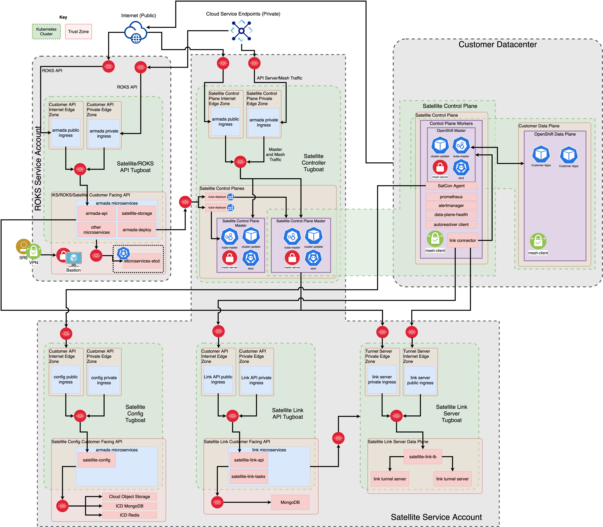

# IBM Cloud Satellite module

Use this Terraform automation to set up a Satellite location on IBM Cloud®. The module provisions the IBM Cloud Satellite location, creates 6 VSIs, assigns three hosts to the control plane, provisions a ROKS Satellite cluster, assigns three hosts to the cluster, and configures a cluster worker pool to an existing ROKS Satellite cluster.

This module is a collection of submodules that make it easier to provision Satellite resources on IBM Cloud.

- location
- host
- cluster
- configure-cluster-worker-pool

## Overview

IBM Cloud Satellite helps you deploy and run applications consistently across all on-premises, edge computing, and public cloud environments from any cloud vendor. It standardizes a core set of Kubernetes, data, AI, and security services to be centrally managed as a service by IBM Cloud, with full visibility across all environments through a single pane of glass. The result is greater developer productivity and development velocity.

https://cloud.ibm.com/docs/satellite?topic=satellite-getting-started

## Features

- Creates Satellite location.
- Creates 6 VSIs with RHEL 7.9.
- Assigns the three hosts to the location control plane.
- *Conditionally creates* these items:
    - Create a Red Hat OpenShift on IBM Cloud cluster and assign the three hosts to the cluster so that you can run Red Hat OpenShift workloads in your location.
    - Configure a worker pool to an existing Red Hat OpenShift Cluster.

<table cellspacing="10" border="0">
  <tr>
    <td>
      
    </td>
  </tr>
</table>

## Compatibility

This module is meant for use with Terraform 0.13 or later.

## Note

- The `location` submodule creates a location or uses an existing location ID or name.
- All optional fields are set to `null` in the `variables.tf` file. You can override the values.
- The `location` submodule downloads the attached host script to the home directory and appends permissions to the script. Use the modified script in the `user_data` attribute of VSI instance.
- If you want to use a particular version of a module, set the argument `version` to the module version.

## Requirements

### Terraform plug-ins

- [Terraform](https://www.terraform.io/downloads.html) 0.13 or later.
- [terraform-provider-ibm](https://github.com/IBM-Cloud/terraform-provider-ibm)

## Install

### Terraform

Be sure you have the correct Terraform version (0.13 or later), you can choose the binary here:
- https://releases.hashicorp.com/terraform/

### Terraform provider plug-ins

Be sure you have the compiled plug-ins on $HOME/.terraform.d/plugins/

- [terraform-provider-ibm](https://github.com/IBM-Cloud/terraform-provider-ibm)

## Example Usage

```hcl
provider "ibm" {
  region  = var.region
}

module "satellite-ibm" {
  source = "github.com/terraform-ibm-modules/terraform-ibm-satellite"

  is_location_exist           = var.is_location_exist
  region                      = var.region
  resource_group              = var.resource_group
  location                    = var.location
  managed_from                = var.managed_from
  location_zones              = var.location_zones
  host_labels                 = var.host_labels
  host_provider               = "ibm"
  create_cluster              = var.create_cluster
  cluster                     = var.cluster
  cluster_host_labels         = var.cluster_host_labels
  create_cluster_worker_pool  = var.create_cluster
  worker_pool_name            = var.worker_pool_name
  worker_pool_host_labels     = var.cluster_host_labels
  create_timeout              = var.create_timeout
  update_timeout              = var.update_timeout
  delete_timeout              = var.delete_timeout
}
```

<!-- BEGINNING OF PRE-COMMIT-TERRAFORM DOCS HOOK -->
## Inputs

| Name                                  | Description                                                       | Type     | Default | Required |
|---------------------------------------|-------------------------------------------------------------------|----------|---------|----------|
| resource_group                        | Resource Group Name to be targeted.                      | string   | n/a     | yes      |
| region                                | The location or the region in which VM instance exists.           | string   | us-east | no       |
| location                              | Name of the Location that to be created                       | string   | n/a     | satellite-ibm |
| is_location_exist                     | Determines if the location must be created                        | bool     | false   | no       |
| managed_from                          | The IBM Cloud region to manage your Satellite location from.      | string   | wdc     | yes      |
| location_zones                        | Allocate your hosts across three zones for higher availability    | list     | ["us-east-1", "us-east-2", "us-east-3"] | no |
| host_labels                           | Add labels to attach host script                                  | list     | [env:prod]  | no   |
| location_bucket                       | Cloud Object Storage bucket name                                  | string   | n/a     | no       |
| host_count                            | The total number of hosts to create for control plane. Set the host_count value to a multiple of 3 (3, 6, 9, or 12 hosts) | number | 3 |  yes |
| addl_host_count                       | The total number of additional host                               | number   | 3       | no       |
| host_provider                         | The cloud provider of host/vms.                                   | string   | ibm     | no       |
| is_prefix                             | Prefix to the Names of all VSI Resources                          | string   | satellite-ibm | yes|
| public_key                            | Public SSH key that is used to provision Host/VSI                 | string   | n/a     | no       |
| location_profile                      | Profile information of location hosts                             | string   | mx2-8x64| no       |
| cluster_profile                       | Profile information of cluster hosts                              | string   | mx2-8x64| no       |
| create_cluster                        | Create cluster: Disable this to prevent creating a cluster        | bool     | true    | no       |
| cluster                               | Name of the ROKS Cluster that has to be created                   | string   | n/a     | yes      |
| cluster_zones                         | Allocate your hosts across these three zones                      | set      | n/a     | yes      |
| kube_version                          | Kubernetes version                                                     | string   | 4.7_openshift | no |
| default_wp_labels                     | Labels on the default worker pool                                 | map      | n/a     | no       |
| workerpool_labels                     | Labels on the worker pool                                         | map      | n/a     | no       |
| cluster_tags                          | List of tags for the cluster resource                             | list     | n/a     | no       |
| create_cluster_worker_pool            | Create Cluster worker pool                                        | bool     | false   | no       |
| worker_pool_name                      | Worker pool name                                                  | string   | satellite-worker-pool | no |
| workerpool_labels                     | Labels on the worker pool                                         | map      | n/a     | no       |
| create_timeout                        | Timeout duration for creation                                     | string   | n/a     | no       |
| update_timeout                        | Timeout duration for updating                                     | string   | n/a     | no       |
| delete_timeout                        | Timeout duration for deletion                                     | string   | n/a     | no       |

## Outputs

| Name                     | Description                      |
|--------------------------|----------------------------------|
| location_id              | Location id                      |
| host_script              | Host registration script content |
| host_ids                 | Assigned host id's               |
| floating_ip_ids          | Floating IP id's                 |
| floating_ip_addresses    | Floating IP addresses            |
| vpc                      | VPC id                           |
| default_security_group   | Security group name              |
| subnets                  | Subnets id's                     |
| cluster_id               | Cluster id                       |
| cluster_worker_pool_id   | Cluster worker pool id           |
| worker_pool_worker_count | worker count                     |
| worker_pool_zones        | workerpool zones                 |

## Pre-commit Hooks

- Run the following command to execute the pre-commit hooks that are defined in `.pre-commit-config.yaml` file:

    ```bash
    pre-commit run -a`
    ```

- You can install the pre-commit tool by running the following command:

    ```bash
    pip install pre-commit`
    ```

## How to input variable values through a file

- To review the plan for the configuration defined (no resources are provisioned), run the following command.

    ```hcl
    terraform plan -var-file=./input.tfvars`
    ```

- To execute and start building the configuration that is defined in the plan (provision resources), run the following command:

    ```hcl
    terraform apply -var-file=./input.tfvars`
    ```

- To destroy the VPC and all related resources, run the following command:

    ````hcl
    terraform destroy -var-file=./input.tfvars`
    ```

All optional parameters are set to null by default in the example's `variables.tf` file. If you want to configure an optional parameter, override the default value.
